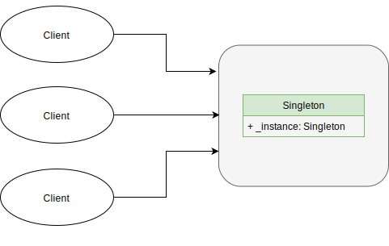

# Singleton Design Pattern

Singleton pattern is one of a creational design pattern. The purpose of the pattern is ensuring a class to be only one instance and providing multiple access points to it.

Resource management or logging systems are good examples of using the singleton pattern since they not only need to provide multiple points of accessing specific instance but also guarantee the instance to be unique.

## Intent

Ensure a class only has one unique instance and provides a global point of access to it.

## Motivation

Sometimes it is necessary to have some classes to have one unique instance. Singleton design handles this problem by letting the class itself responsible for keeping track of its sole instance and providing a way to access the instance. The class should guarantee that no other instance can be created.

## Applicability

Singleton pattern is useful when:

* Ensure that a class has just a single instance
* Provide access point to clients

## Structure

## Consequences

Singleton provides the following advantages:

1. Controlled access to a sole instance
2. Reduced namespace
3. Permits refinement of operations and representation
4. Permits a variable number of instances
5. More flexible than class operations

## Caveats

* It violates the Single Responsibility Principle by solving two problems, which are uniqueness and providing global access points.
* It could increase the complexity of code by exposing too much information from the unique class.
* If your program uses multithread operations, you need to prevent each thread from making their singleton object.

## Implementation

[Code](https://github.com/jihoonerd/Design-Patterns)
